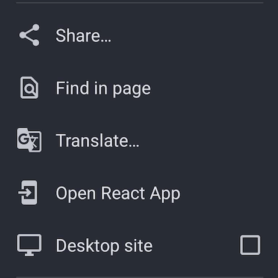
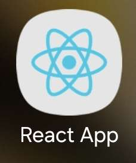

# Using Senyas

**To see how the application works, just visit the homepage at [https://senyas.vercel.app/](https://senyas.vercel.app/).**

## Download On Your Device 

You can downlaod the application on your device by going to Google Chrome. 

Click on the "three dots" and then click on Open React App:

Once you click that, it should install the React Application on your device like so:

Once you have downloaded the Application you can now access it as an application on your phone. 

Note: This application requires the internet to function, and model prediction is subject to the strength of user device.